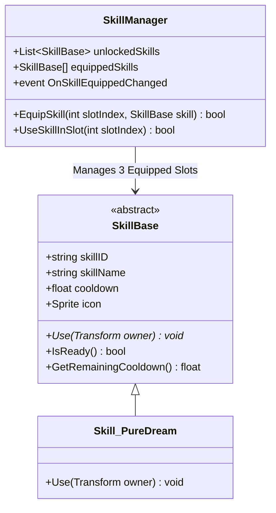

# Implementation Plan - 스킬 시스템 기초 아키텍처 및 슬롯 장착 틀 구축

Final Curtain Call 프로젝트의 **스킬 시스템 기초 틀(Skill Framework)**과 **3슬롯 장착 관리 메커니즘**을 구축하기 위한 1단계 구현 계획입니다.

---

## 1. 개요 및 목적 (Goal & Background)

* **스킬 시스템 기초 아키텍처**: 모든 스킬이 상속받아 동작할 확장 가능한 추상 기본 클래스(`SkillBase`) 및 데이터 구조 정의.
* **3슬롯 장착 시스템 (`SkillManager`)**: 해금된 스킬 중 최대 3개를 장착하고, 입력 키에 맞게 발동/쿨타임을 관리하는 시스템 작성.
* **기초 스킬 샘플 (1종)**: 틀 검증을 위한 기본 스킬 `Skill_PureDream` 1종 구현 및 피격/이벤트 연동 확인.
* **거울 정비 UI 연동 준비**: `SaveMirror` 상호작용 시 UI로 장착 상태를 전달할 수 있는 이벤트 데이터 구조 설계.

---

## 2. 세부 구현 단계 (1단계: 기초 틀 구축)

### [Step 1-1] `SkillBase.cs` 추상 클래스 설계
* **위치**: `Assets/_Project/Assets/Scripts/_Player/Skill/SkillBase.cs`
* **주요 필드 및 메서드**:
  * `skillID`, `skillName`, `description`, `cooldown`, `icon`
  * `[HideInInspector] float lastUsedTime`
  * `virtual bool IsReady()`: 쿨타임 충족 여부 검사
  * `abstract void Use(Transform owner)`: 실제 스킬 로직 (하위 클래스 구현)
  * `virtual float GetRemainingCooldown()`: 남은 쿨타임 계산 (UI용)

### [Step 1-2] `SkillManager.cs` 리팩토링 및 3슬롯 장착 로직
* **위치**: `Assets/_Project/Assets/Scripts/_Player/Skill/SkillManager.cs`
* **주요 기능**:
  * `List<SkillBase> unlockedSkills`: 보유/해금된 스킬 목록
  * `SkillBase[] equippedSkills = new SkillBase[3]`: 3개 장착 슬롯 (슬롯 0, 1, 2)
  * `EquipSkill(int slotIndex, SkillBase skill)`: 특정 슬롯에 스킬 장착/교체
  * `UseSkillInSlot(int slotIndex)`: 슬롯별 입력 처리 (Input System Action 또는 키보드 매핑)
  * 쿨타임 이벤트 및 변경 이벤트 제공 (`onSkillEquipped`, `onSkillUsed`)

### [Step 1-3] 샘플 스킬 `Skill_PureDream.cs` 구현
* **위치**: `Assets/_Project/Assets/Scripts/_Player/Skill/Skill_PureDream.cs`
* `SkillBase`를 상속받아 플레이어 전방 정화 이펙트/콜라이더 감지 샘플 구현.

---

## 3. 구조 도해 (Architecture Diagram)

---

## 4. 검증 및 테스트 계획 (Verification Plan)

1. **컴파일 검증**: `SkillBase.cs`, `SkillManager.cs`, `Skill_PureDream.cs` 정상 컴파일 확인.
2. **단위 기능 검증**:
   * 인스펙터에서 `SkillManager`에 스킬 등록 후 슬롯 0, 1, 2에 장착 테스트.
   * 슬롯별 키 입력 시 쿨타임 동작 및 `Skill_PureDream` 발동 확인.
   * 이미 장착된 스킬의 슬롯 교체(`EquipSkill`) 시 정상 갱신되는지 확인.
